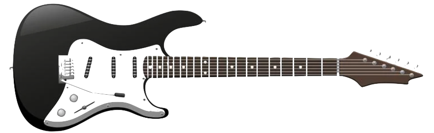

.. Guitar Practice documentation master file, created by
   sphinx-quickstart on Sat Apr  3 16:21:02 2021.

Practicing Guitar
=================

A curated source of ideas and techniques for guitar practicing.

.. list-table::
   :widths: 25 50
   :header-rows: 0

   * - :ref:`about`
     - Purpose, outline, q&a
   * - :ref:`part-1-on-technique`
     - the role of the central nervous system, speed, tension and relaxation, and an effective practice routine
   * - :ref:`part-2-setting-up`
     - getting organized, preparing your practice routine
   * - :ref:`part-3-techniques`
     - practice techniques and variations to learn licks, technique, and repertoire more quickly and thoroughly
   * - :ref:`part-4-misc`
     - short notes on the bigger picture: repertoire, improvisation, memorization, etc.
   * - :ref:`part-5-appendices`
     - references

.. toctree::
   :maxdepth: 5
   :hidden:
   :name: mastertoc

   about/_index
   part-1-on-technique/_index
   part-2-setting-up/_index
   part-3-techniques/_index
   part-4-misc/_index
   part-5-appendices/_index
   todo
   feedback
